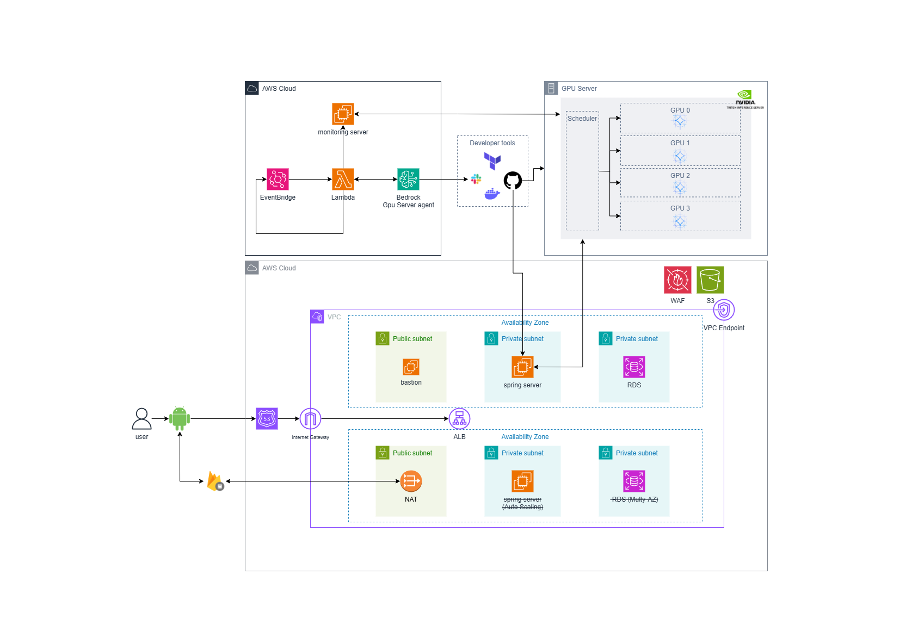
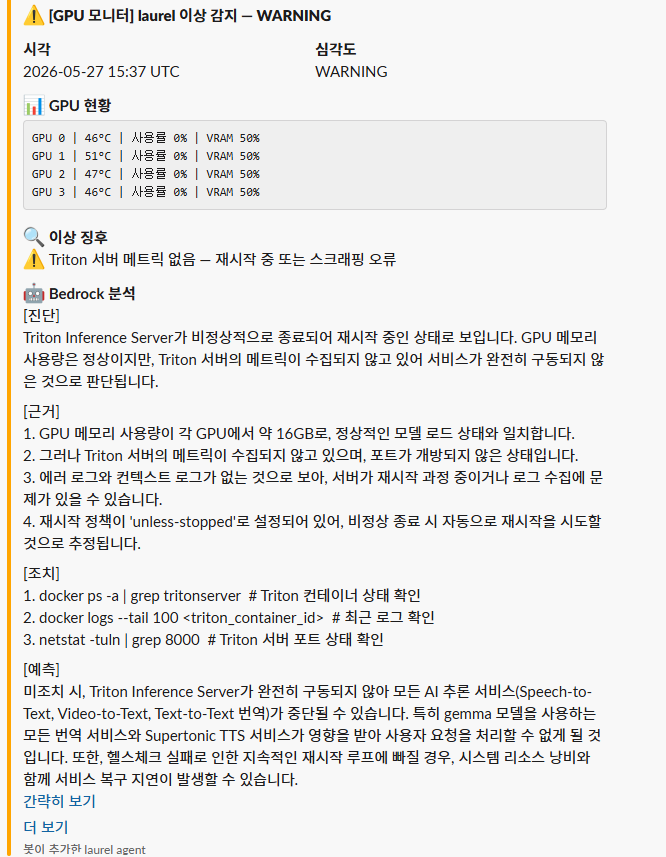
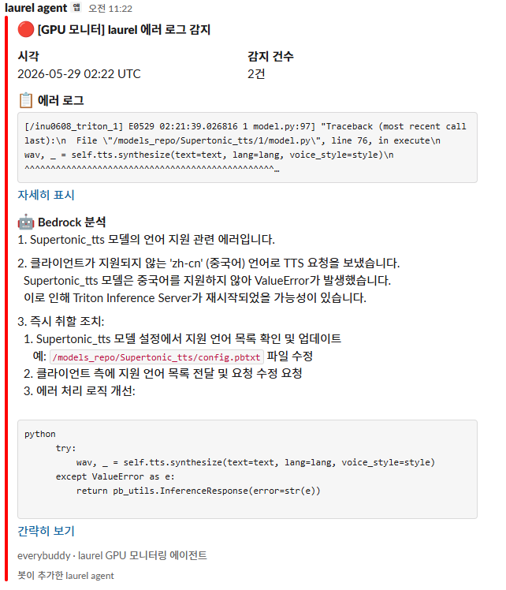

# everybuddy Infra

AWS 기반 everybuddy 서비스 인프라를 Terraform으로 관리하는 레포지토리입니다.

---



## 프로젝트 소개

everybuddy는 글로벌 음성/채팅 번역 메신저 서비스로, 클라우드 인프라 전 영역을 Terraform으로 코드화하여 관리합니다. Spring Boot 백엔드와 RDS를 Private 서브넷에 격리하고 ALB·WAF로만 외부에 노출시키는 구조를 갖췄으며, 별도의 GPU 추론 서버(Nvidia Triton)를 Bedrock 기반 에이전트가 자동으로 모니터링하도록 구성했습니다. Grafana·Prometheus·Loki로 애플리케이션과 GPU 서버의 로그·지표를 한 곳에서 관측하고, GitHub Actions와 Bastion을 경유한 CI/CD 파이프라인으로 배포까지 자동화한 것이 특징입니다.

## 아키텍처 흐름

- **사용자 요청 경로**: Android 앱 사용자 → WAF → ALB → Private 서브넷의 Spring 서버 → RDS
- **외부 연동**: 파일 업로드/다운로드는 VPC Endpoint를 통해 NAT GW 우회로 S3에 접근하고, Firebase 실시간 동기화 등은 NAT GW를 통해 아웃바운드로 연결
- **운영 접근**: 관리자는 Bastion EC2를 거쳐 Private 백엔드에 SSH로 접근하며, GitHub Actions 배포도 동일하게 Bastion ProxyJump를 경유
- **모니터링**: 모니터링 서버가 백엔드·GPU 서버의 로그/지표를 Promtail·Prometheus로 수집해 Grafana로 시각화
- **Agent 자동 대응**: EventBridge가 주기적으로 Lambda를 트리거 → Bedrock 에이전트가 모니터링 지표를 분석해 GPU 서버 이상을 감지 → Slack/GitHub(Developer tools)로 알림 및 조치가 GPU 서버의 Scheduler로 전달되어 GPU 0~3에 분산된 Triton 추론 서비스에 반영

---

## 모듈 구조

```
modules/
├── networking/   # VPC, Subnet, IGW, NAT GW, Route Table
├── security/     # Security Groups
├── compute/      # EC2, Key Pair, EIP
├── storage/      # S3
├── database/     # RDS, DB Subnet Group
├── dns/          # Route53 Hosted Zone
├── alb/          # ALB, ACM, Target Group, Listeners, Route53 A Record
├── waf/          # WAF v2 (IP Reputation, AllowTranslate, CommonRuleSet, KnownBadInputs)
├── bedrock_agent/ # Lambda GPU 모니터링 에이전트 (Bedrock + Prometheus + Loki)
└── datalake/     # S3 Data Lake (GPU 에러 이력 저장)
```

---

## CI/CD

GitHub Actions → Bastion ProxyJump → Private Backend

```
Push to main
  └── GitHub Actions
        ├── Docker build & push (Docker Hub)
        ├── SCP docker-compose.yml → Bastion → Private Backend
        └── SSH → Bastion → Private Backend → docker compose up -d
```

---

## 핵심 설계 사항

### 온프레미스 GPU 서버(V100×4) 기반 LLM 모델 서빙 인프라 운영 환경 구성

CPU/GPU 인스턴스 분리 배치, 다중 모델(번역·TTS) 동시 서빙, Triton Inference Server - Spring Boot 연동

**1. 멀티 모델 GPU 리소스 배치**

| 구분 | 내용 |
| ---- | ---- |
| 상황 | V100 32GB×4 위에 번역 모델 3종(gemma_s2tt / t2tt / v2tt)과 TTS 모델을 동시 서빙해야 함 |
| 판단·근거 | gemma_s2tt는 GPU 0/1에 2개 인스턴스, gemma_t2tt는 GPU 2/3에 2개 인스턴스로 분산해 특정 GPU에 부하가 몰리지 않게 배치. TTS(Supertonic)는 연산량이 가벼워 KIND_CPU로 지정해 굳이 GPU를 점유하지 않도록 분리 |
| 결과 | GPU 자원을 모델 특성(연산 강도)에 맞게 차등 배분해 4장으로 4종 모델을 동시 운영 |

**2. 온프레미스-AWS 하이브리드 네트워크 연동**

| 구분 | 내용 |
| ---- | ---- |
| 상황 | laurel(사내 온프레미스 GPU 서버)이 AWS VPC 외부에 있어 Spring 백엔드가 직접 호출 불가, 사내 방화벽이 인바운드를 차단 |
| 판단·근거 | SSH 리버스 터널(autossh) vs 회사에 포트 개방 요청, 두 방식을 비교해 운영 복잡도가 낮은 포트 개방을 우선 요청하고 터널은 폴백으로만 준비. 승인 후에는 용도별로 소스 IP를 분리(API 트래픽은 NAT Gateway IP, 모니터링 트래픽은 별도 모니터링 서버 IP로 화이트리스트) |
| 결과 | 트래픽 목적별 접근 통제를 갖춘 하이브리드 연동 구조 확립 |

**3. 신규 모델 통합 시 의존성 충돌 해결**

| 구분 | 내용 |
| ---- | ---- |
| 상황 | TTS 기능 추가 시 처음 검토한 GPT-SoVITS 라이브러리의 transformers 버전 요구사항이 기존 Gemma-4 모델이 필요로 하는 버전과 충돌 |
| 판단·근거 | 동일 컨테이너에 억지로 우겨넣지 않고 별도 컨테이너/프로세스로 분리하는 방안을 먼저 검토했다가, 최종적으로는 의존성 충돌이 없는 경량 TTS 라이브러리(Supertonic)로 대체해 기존 Triton 컨테이너 안에 CPU 인스턴스로 안전하게 통합 |
| 결과 | 기존 서빙 환경(Gemma 계열)을 건드리지 않고 신규 모델을 추가하는 의존성 관리 판단 경험 |

### AWS Bedrock을 활용한 GPU 서버 관제 및 이슈 감지 시 Slack 알림·해결 방안 제공 Agent 설계

Lambda+EventBridge 서버리스, 이상 감지 시 Bedrock 호출·Slack 알림, 반복 오탐 쿨다운 로직 개선

<details>
<summary>실제 동작 스크린샷</summary>




</details>

**1. 설계 이유**

| 구분 | 내용 |
| ---- | ---- |
| 상황 | GPU 서버(laurel)가 관리 중인 AWS 클라우드 환경과 물리적으로 분리된 온프레미스 환경에 위치해 별도 관리 필요. 번역 메신저 서비스 특성상 번역 모델의 안정적 구동이 핵심 기능이라 관리 우선순위가 높다고 판단 |
| 판단·근거 | 단순 임계값 알림이 아닌, 메트릭·로그·GPU 온도·메모리 할당량까지 종합 분석해 이상 여부와 해결 방안까지 제시하는 Bedrock + Lambda + EventBridge(2분 주기 트리거) 구조로 설계 |
| 결과 | 이벤트 기반 서버리스 감시 체계 아키텍처 확립 |

**2. 모델 선택과 비용 최적화**

| 구분 | 내용 |
| ---- | ---- |
| 상황 | Bedrock에서 어떤 Claude 모델을 호출할지 결정 필요 |
| 판단·근거 | Claude 3 Haiku(구형)와 Claude 3.5 Sonnet($3/$15 per M 토큰, 로그 분석용으로는 과스펙)을 비교해 Claude 3.5 Haiku($0.80/$4.00 per M 토큰)를 비용 대비 효율로 선택. 완전 자동 복구(Bedrock Agent Action Groups)는 신뢰성이 검증되지 않은 상태에서 자동 액션을 실행하는 리스크가 크다고 판단해 1차 범위는 "알림·해결방안 제시"까지로 제한 |
| 결과 | 평시 월 $0.6-1.2, 장애 폭증 시에도 최대 약 $13(전체 인프라 비용의 1-4% 수준)로 비용 통제 |

**3. 실배포 및 운영 검증**

| 구분 | 내용 |
| ---- | ---- |
| 상황 | 설계에 그치지 않고 실제 Lambda 함수(everybuddy-gpu-monitor)로 배포 |
| 판단·근거 | aws lambda invoke로 실행해 런타임 에러(코드 문법 오류)를 실제로 잡아 수정. 이후 정상 실행 결과(severity: NORMAL)를 확인하고, 실제 Slack으로 "[GPU 모니터] laurel 이상 감지 — WARNING" 메시지가 GPU 온도·VRAM 수치와 함께 수신되는 것까지 검증 |
| 결과 | 설계 문서로 끝나지 않고 실제 배포·실행·알림까지 엔드투엔드로 동작 확인 |

---

## 최신 패치 — v3.3.0

**날짜:** 2026-06-15 · **브랜치:** `dev`

🗄️ S3 Data Lake 도입 — GPU 에러 이력 구조화 저장 (Athena 쿼리 가능한 파티션 구조)

> 전체 변경 이력은 [docs/](./docs/) 참고

---

## 패치 이력

| 버전                         | 날짜       | 내용                                          |
| ---------------------------- | ---------- | --------------------------------------------- |
| [v3.3.0](./docs/v3.3.0.md)   | 2026-06-15 | S3 Data Lake 도입 (GPU 에러 이력 저장)                       |
| [v3.2.0](./docs/v3.2.0.md)   | 2026-05-29 | Bedrock 에이전트 고도화 (Loki 연동 · Cooldown · 트리거 정제) |
| [v3.1.0](./docs/v3.1.0.md)   | 2026-05-27 | Bedrock GPU 모니터링 에이전트 도입 + WAF 영상 업로드 허용 |
| [v3.0.0](./docs/v3.0.0.md)   | 2026-05-18 | WAF 업로드 허용 확장 + Bastion → RDS 접근 허용 |
| [v2.10.0](./docs/v2.10.0.md) | 2026-05-16 | 봇 차단 강화 + S3 VPC Endpoint (NAT GW 절감) |
| [v2.9.0](./docs/v2.9.0.md)   | 2026-05-13 | 인스턴스 스펙 상향 + WAF 번역 엔드포인트 허용 |
| [v2.8.0](./docs/v2.8.0.md) | 2026-05-09 | 외부 GPU 서버 → Loki 로그 수집 허용    |
| [v2.7.0](./docs/v2.7.0.md) | 2026-04-30 | WAF(Web Application Firewall) 추가     |
| [v2.6.1](./docs/v2.6.1.md) | 2026-03-18 | 보안: .claude/ gitignore 처리          |
| [v2.6.0](./docs/v2.6.0.md) | 2026-03-13 | S3 Remote Backend 설정                 |
| [v2.5.0](./docs/v2.5.0.md) | 2026-03-13 | 모니터링 SG 보완                       |
| [v2.4.0](./docs/v2.4.0.md) | 2026-03-11 | 백엔드 서버 Private 전환               |
| [v2.3.0](./docs/v2.3.0.md) | 2026-03-11 | ALB + ACM (HTTPS) 구성                 |
| [v2.2.0](./docs/v2.2.0.md) | 2026-03-10 | Bastion 서버 + Route53 구성            |
| [v2.1.0](./docs/v2.1.0.md) | 2026-03-10 | RDS MySQL 구성                         |
| [v2.0.0](./docs/v2.0.0.md) | 2026-03-10 | Terraform 모듈화 + Private 서브넷 준비 |
| [v1.2.0](./docs/v1.2.0.md) | 2026-02-05 | 백엔드 스펙 업그레이드 + EIP           |
| [v1.1.0](./docs/v1.1.0.md) | 2026-01-13 | 모니터링 서버 추가                     |
| [v1.0.0](./docs/v1.0.0.md) | 2026-01-11 | 초기 인프라 구성                       |
