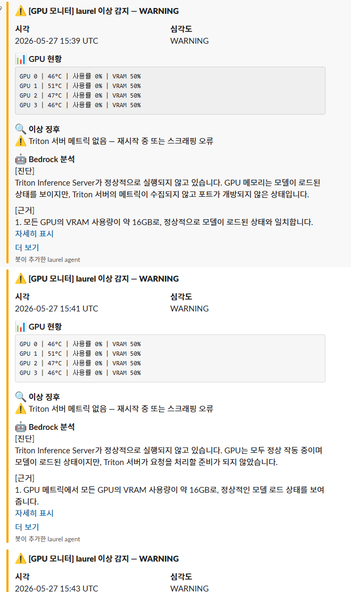
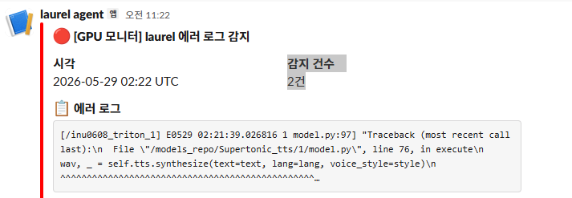

# 관제 에이전트 알림 신뢰도(Signal-to-Noise) 개선

---

## 상황

Bedrock+Lambda+EventBridge(2분 주기) 기반 GPU 관제 에이전트를 실제 배포해 laurel 서버를 모니터링하던 중, 운영 단계에서 예상 못 했던 문제 세 가지가 연달아 발생.

중복 알림

- 사내 방화벽 승인 대기로 Triton 메트릭 포트(8002)가 아직 열리지 않은 상태 → 메트릭 부재 자체가 이상으로 감지되어 2분마다 "Triton 서버 메트릭 없음" 경고가 반복 발송
- 장애가 즉시 해소되지 않는 경우, 동일한 이슈에 대해 2분 트리거마다 같은 알림이 계속 재발송되며 Bedrock 토큰과 Slack 채널을 낭비
- 관제 에이전트가 GPU/Triton과 무관한 백엔드 애플리케이션 로그(JWT 인증 실패 등)까지 수집해 laurel GPU 채널로 잘못 전달

---

## 판단 및 근거

1. Triton 메트릭 부재는 "이상 상태"가 아니라 "외부 요인(방화벽 승인 대기)으로 인한 일시적 제약"으로 재정의, 트리거 조건에서 제외(포트 개방 시 자동으로 다시 수집되도록 설계)
2. 메트릭 기반 이상(WARNING/CRITICAL) 알림에는 이슈 목록을 정렬해 MD5 해시로 fingerprint를 생성하고, 동일 해시가 30분 이내 재발생하면 Bedrock 호출과 Slack 전송을 스킵하는 쿨다운 로직 도입(Lambda 전역변수 기반 Warm Start 방식). 반면 에러 로그 기반 알림에는 의도적으로 쿨다운을 적용하지 않음 — 로그는 매번 다른 원인일 수 있어 이슈 목록 해시로 묶이지 않는 새로운 사건으로 간주해야 한다고 판단
3. 백엔드 애플리케이션 로그 유입 문제는 "탐지되는 건 다 알린다"가 아니라 "GPU/Triton 이슈만 알린다"는 명확한 스코프가 필요하다고 판단, Loki 로그 조회를 `service_name="triton"`으로 좁혀 다른 컨테이너 로그가 이 채널에 섞이지 않도록 필터링
4. 세 판단 모두 "탐지 범위를 넓히는 것"보다 알림의 신뢰도(signal-to-noise)를 지키는 것을 우선한 설계 원칙 — 알림이 잦고 부정확해지면 결국 무시당해 관제 체계 자체가 무력화된다는 문제의식에서 나온 판단

---

## 결과

동일 이슈에 대한 2분 주기 반복 알림 제거, GPU/Triton 관련 이슈만 정확히 필터링되는 관제 채널로 정리.

개선 후

실제 이상 발생 시에는 GPU 온도·VRAM 수치를 포함한 정상 알림이 발송되는 것을 확인해 관제 체계의 실효성 검증. 쿨다운 로직 적용 후 정상 운영 시 Bedrock 호출 비용은 거의 발생하지 않아 월 $0.1 미만 수준으로 운영.

---

## 관련 문서

- [v3.1.0](../v3.1.0.md) — Bedrock GPU 모니터링 에이전트 도입
- [v3.2.0](../v3.2.0.md) — Bedrock 에이전트 고도화 (Loki 연동 · Cooldown · 트리거 정제)
